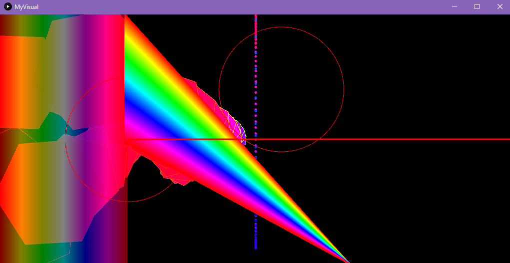
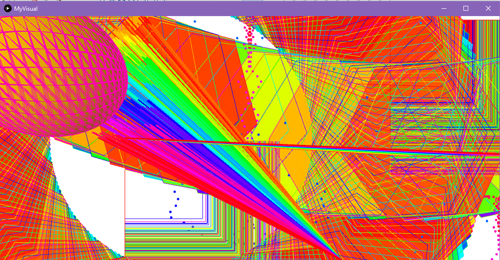

# Music Visualiser Project

Name: Allyanna Riyann Cruz

Student Number: C18310641

# Description of the assignment

For my assignment, I have *circles/bubbles* that change size and colour with the music. They remind me of bubbles, at certain angles you can see a rainbow, reminded me of that.

I have *hexagons* that look like they're twirling, they look a bit like dragon scales. It reminds me of the SuperMario rainbow racetrack. 

There is a *heart* at the middle of the screen that moves and disperses depending on the sound. The dots look like they are dancing to the music. I thought it was cool to have a heart that wasn't connected. 

There are more *hexagons* that are floating around, they look like asteroids floating in the galaxy. I used rotateX and rotateY, so it looks like they are flying from your point of view into the screen and around and goes towards you. They look like they are spinning, these also change colour. I have a lot of hexagons because I was trying to code up some stars, but I couldn't get it quite right and I ended up just leaving it to a hexagon.

I modified the *WaveForm.java* class, the waves are on the left  side of the screen and is vertical and see through.

I have *sticks* that look like a spotlight coming from the bottom of the screen, this shows the wave form of whatever sound is playing/hearing.

I have a *horizontal* line at the middle of the screen. It reminds me of the horizon. It changes colour and size depending on the AudioBuffer or Amplitude. It looks like it is moving up or down.

I have a *Sphere/Globe* that moves according to the music. I used the camera() function. It shows up when you click the mouse and appears on a spot depending where the mouse is. It looked like a globe that was dancing to music. 

I think my assignment looks cool while you are listening to music. Though it is quite colourful, I find it relaxing to watch.

I had left space on the right hand part of the screen so the flying hexagons could be seen flying. They sometimes look like they are flying over shapes and look like a rollercoaster.

I used inheritance - the starter code already inherited the Visual abstract class. I created objects on the myVisual.java but were types from classes from different files. Instead of coding all of the visuals on the MyVisuals, I found it easier to create a new class every time I wanted to create new shape/visual.

``` Java
public class MyVisual extends Visual {
}
```

# Instructions

- When you press the space key, the music starts and the visuals start to move according to the music.
-  The music is a bit delayed, I'm not sure if it's my computer but the music should play after a few seconds.
- When you press the 's' key, squares pop up and change size and colours depending on the AudioBuffer. When pressed again the squares disappear.
- When you press the '2' key, hexagons that don't move show up. The colours are according to the AudioBuffer. 
- When you press the '8' key, the background changes to white and when you press it again it goes back to black.
-  When the *mouse is clicked* a sphere shows up depending on where your mouse is (mouseX, mouseY).


# How it works

I have a few branches because I liked keeping track of things that worked while I was working on the assignment. I never really pushed on the master branch until I was happy with everything.

1. The *circles/bubbles* do not move positions. There are many circles (the AudioBuffer size). They move according to the sound. They also change colours according to the sound. There are two of them since one is *translated*.

2. The *Sphere* rotates, changes colour depending on the song. If no sound/song is being layed/heard, then it is just a dot. It also changes size depending on the music, and its location on the screen because of the camera() function. MouseX and mouseY helps with the placing of the sphere/globe. The sphere/globe only shows up when you click on the mouse. In the YouTube video I tried clicking on certain places in the screen so the size of the sphere is shown from different angles. I kept clicking my mouse so you can see what the sphere/globe looks like.

3. The *hexagons* from the FloHex class look like they are flying around, like they are in space. They are plenty of them (AudioBuffer size) and they look shooting stars grouped together. You have to keep watching them as the size and colour changes because of the AudioBuffer size. It starts off looking like dragon scales and flies around the place. It looks like they are flying towards you and from behind you. I used one function with 4 parameters to draw the hexagons and called it from another function in the class file. I thought it would be best to do that so it is less confusing and looks neater.

4. The *hexagons* from the Stars class show up only when '2' is pressed because I thought it would not show the other shapes on the screen. I also used one function with 4 parameters to draw the hexagons and called it from another function in the class file, like the FloHex class.

5. The *Waveform class* I modified, looked cool as it it not completely opaque. You can see the hexagons flying behind it. I used the AudioBuffer size to change the colour to a gradient rainbow, but it only moves according to sound.

6. The *Sticks* also move according tosound, when no sound is playing it looks like a rainbow stream. I thought it would be cool to have sticks because they look like those lights that have a bunch os strings attached to them, so the clear strings look like they are lighting up. The wave form is shown at the top of the sticks.

7. There is a *horizontal* line at the middle of the screenit is thin and stays red when no sound is playing. The thickness and colour changes due to the Amplitude.

8. The squares only show up when the 's' is pressed, I didn't want all of the visuals on screen at the same time. I liked seeing what each of the objects can do by themselves. the squares look like the static from old TVs.

9. When the background changes to white the waves from the Waveform are not seen, when thw background is black it can be seen. I thought it would look nice to see what the visuals looked like with a different background so I added an option to change the background colour when '8' is pressed.

10. The *heart* at the middle of the screen is drawn by dots, so it is a disconncetd heart. By doing this the dots from the heart can disperse around the screen, but it eventually changes shape according to the sound. The amount of dots is determined by the AudioBuffer size.

 

# What I am most proud of in the assignment

I am most proud of The *hexagons* from FloHex and Stars. Even though I had intended to draw stars, the hexagons turned out better than I expected. The hexagons from Stars look like they a folded around. I think the colours turned out nice, they look great together (the fill and stroke). The hexagons from FloHex really do look like they are floating is space and spinning. 

``` Java
 mv.pushMatrix();
            for(int j = 0; j < mv.getAudioBuffer().size(); j++)
            {
                mv.beginShape();
                for (float a = 0; a <= TWO_PI; a += angle) 
                {
                    mv.vertex(starx, stary);
                    starx = (float) (mv.getAudioBuffer().get((int) a) + Math.cos(a + halfAngle) * 180 );  // try fix this
                    stary = (float) (mv.getAudioBuffer().get((int) a) + Math.sin(a + halfAngle) * 180 );
                    mv.vertex(starx, stary);
                    mv.translate((float) (scrwidth*0.8), mv.getAudioBuffer().size());
                    mv.rotate((float) (mv.getAudioBuffer().size()/ 100.0));
                    //mv.rotate((float) (Math.PI * 3.0));
                    mv.rotateY(ang);
                    mv.rotateX(ang);
                } // end inner for
                mv.endShape();
                mv.stroke(
                        PApplet.map(j, 0, mv.getAudioBuffer().size(), 0, mv.getAudioBuffer().size())
                        , 255
                        , 255
                    );
    
                    mv.fill(
                        PApplet.map(j, 0, mv.getAudioBuffer().size(), mv.getAudioBuffer().size(), 0)
                        , 255
                        , 255
                    );
                    mv.rotate((float) (Math.PI * 3.0));
            } // end outer for
           
            mv.popMatrix();
            ang += 0.01f;
```

I'm proud of the heart too, I didn't think it would look cool when it was moving and dispersing but it I think it does.

I am also proud that I am more comfortable with the Processing language. I found it a bit challenging at the start ofthe module, since I have not coded any graphics before.

This was an enjoyable assignment and I feel that I learned a lot from trial and error and trying out and learning new things by myself. 

# Images






# Youtube Video


This is a youtube video:

[](https://www.youtube.com/watch?v=J2kHSSFA4NU)


